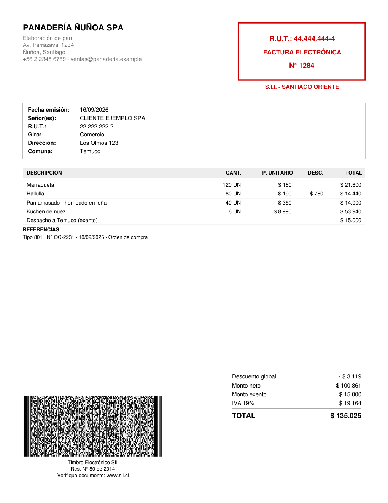
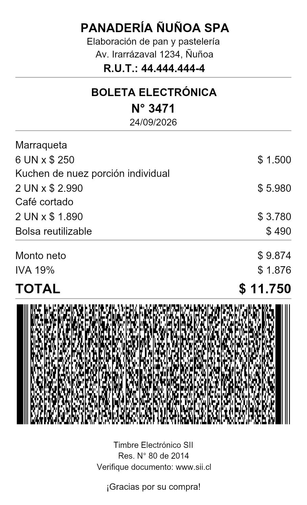
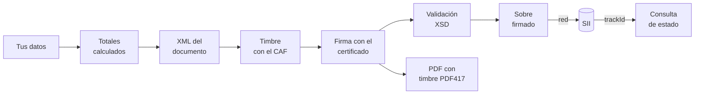

<div align="center">

# typeDTE

**Facturación electrónica chilena en TypeScript.**

Los 12 tipos de documento tributario del SII: se arman, timbran, firman, envían y se imprimen.<br>
Con tipos que convierten los rechazos del SII en errores de compilación.

[](LICENSE)
[](https://nodejs.org)
[](tsconfig.json)
[](#qué-incluye)

[Uso rápido](#uso-rápido) · [Por qué TypeScript](#por-qué-typescript) · [Guía](#guía) · [Decisiones técnicas](#decisiones-técnicas) · [Limitaciones](#limitaciones) · [English](#english)

<br>


&nbsp;&nbsp;


<sub>Factura en tamaño carta y boleta en ticket de 80 mm, generadas por typeDTE con credenciales de prueba.<br>El código de barras contiene el timbre firmado y se lee de vuelta byte a byte.</sub>

</div>

---

## Uso rápido

```ts
import { emitir, TIPO, type FacturaAfecta } from 'typedte-sii';

const factura: FacturaAfecta = {
    tipo: TIPO.FACTURA_AFECTA,
    folio: 1,
    fechaEmision: '2026-09-16',
    emisor: {
        rut: '44.444.444-4',
        razonSocial: 'PANADERÍA ÑUÑOA SPA',
        giro: 'Elaboración de pan',
        actividadesEconomicas: [107100],
        direccion: 'Av. Irarrázaval 1234',
        comuna: 'Ñuñoa',
    },
    receptor: {
        rut: '22.222.222-2',
        razonSocial: 'CLIENTE EJEMPLO SPA',
        giro: 'Comercio',
        direccion: 'Los Olmos 123',
        comuna: 'Temuco',
    },
    items: [
        { nombre: 'Marraqueta', cantidad: 120, precioUnitario: 180 },
        { nombre: 'Despacho', monto: 15000, exento: true },
    ],
};

// caf y certificado: ver "Leer las credenciales" más abajo.
const emitido = emitir(factura, { caf, certificado, timestamp: '2026-09-16T10:30:00' });

emitido.xml;     // documento firmado, en ISO-8859-1, listo para enviar
emitido.totales; // { neto: 21600, exento: 15000, iva: 4104, total: 40704, ... }
```

Una llamada calcula los totales, arma el XML, lo timbra con el CAF y lo firma con el certificado. Funciona igual para los 12 tipos.

¿Sin credenciales a mano? `npm run ejemplo` hace lo mismo con un CAF y un certificado de prueba generados al vuelo.

---

## Por qué TypeScript

En la facturación electrónica chilena, un error cuesta un folio. El SII los entrega de a pocos, y cada documento rechazado gasta uno sin explicar bien por qué.

Un DTE cambia de forma según su tipo. Una nota de crédito tiene que referenciar el documento que corrige, una guía de despacho necesita el motivo del traslado, y una boleta nombra al emisor con campos distintos a los de una factura. En TypeScript esas reglas son parte del tipo, así que el error aparece en el editor y no en el rechazo:

```ts
const nota: NotaCredito = {
    tipo: TIPO.NOTA_CREDITO,
    folio: 1,
    fechaEmision: '2026-09-16',
    emisor,
    receptor,
    items: [{ nombre: 'Devolución', monto: 10000 }],
};
// ✗ no compila: una nota de crédito sin `referencias` no existe
```

Estas garantías están probadas en [`test/tipos.compilacion.ts`](test/tipos.compilacion.ts): si un cambio llegara a dejar compilar un documento inválido, `npm run check` falla.

### Lo que se detecta antes de gastar un folio

| Dónde | Qué detecta |
|---|---|
| **El compilador** | nota sin referencia · guía sin motivo de traslado · documento sin líneas · tipo inexistente · emisor sin actividad económica · boleta en un sobre de facturas · liquidación sin comisiones o con descuentos por línea |
| **El cálculo de totales** | línea sin monto ni precio · descuento en monto y porcentaje a la vez · descuentos que dejan el neto bajo cero · más líneas de las que admite el SII · comisiones mayores que lo vendido |
| **La validación de RUT** | dígito verificador incorrecto en emisor, receptor, transportista, sobres y libros |
| **El CAF** | folio fuera del rango autorizado · CAF de otro tipo de documento |
| **El certificado** | vencido a la fecha de emisión · clave incorrecta · archivo que no es un certificado |
| **El esquema oficial del SII** | estructura, orden de campos, largos, namespace |

---

## Qué incluye

| Código | Documento | |
|:---:|---|---|
| 33 | Factura electrónica | |
| 34 | Factura no afecta o exenta | |
| 39 | Boleta electrónica | precios con IVA incluido, receptor opcional |
| 41 | Boleta exenta | |
| 43 | Liquidación-factura | descuenta las comisiones del consignatario |
| 46 | Factura de compra | retiene el IVA completo |
| 52 | Guía de despacho | motivo de traslado y datos de transporte |
| 56 | Nota de débito | |
| 61 | Nota de crédito | |
| 110 | Factura de exportación | moneda extranjera, 4 decimales, bloque de aduana |
| 111 | Nota de débito de exportación | |
| 112 | Nota de crédito de exportación | |

Además:

- **Timbre electrónico (TED)** firmado con la llave del CAF.
- **Firma XMLDSig** con el certificado del contribuyente (.p12 / .pfx).
- **Validación** contra los esquemas XSD oficiales del SII, incluidos en el repositorio.
- **Comunicación con el SII**: autenticación con semilla y token, envío de sobres y consulta de estado, en certificación (Maullín) y producción (Palena).
- **Libros** de ventas, compras y guías de despacho.
- **PDF** en dos formatos: tamaño carta y ticket para impresora térmica de rollo, con el timbre en código PDF417.

---

## Instalación

```bash
npm install typedte-sii
```

Requiere Node.js 22 o superior.

---

## Guía

### Leer las credenciales

Para emitir se necesitan dos archivos: los folios que entrega el SII y el certificado digital que vende un proveedor.

```ts
import { readFileSync } from 'node:fs';
import { cargarCertificado, parseCaf } from 'typedte-sii';

// El archivo de folios que se descarga desde sii.cl, uno por tipo de documento.
const caf = parseCaf(readFileSync('FoliosSII33.xml', 'latin1'));

// El certificado digital de la persona que firma por la empresa.
const certificado = cargarCertificado(readFileSync('certificado.pfx'), process.env.CLAVE_CERTIFICADO!);
```

### Enviar al SII

Los documentos viajan en un sobre firmado. El SII responde con un `trackId`:

```ts
import {
    construirEnvioDte,
    enviarDocumentos,
    firmarDocumento,
    ID_SET_DTE,
    obtenerToken,
    RUT_SII,
    serialize,
    XML_DECLARATION,
} from 'typedte-sii';

const token = await obtenerToken(certificado, { ambiente: 'certificacion' });

const sobre = construirEnvioDte(
    {
        rutEmisor: '44444444-4',
        rutEnvia: '11111111-1', // el titular del certificado
        rutReceptor: RUT_SII,
        fechaResolucion: '2014-08-22',
        numeroResolucion: 80,
        timestampFirma: '2026-09-16T10:31:00',
    },
    [emitido.firmado]
);

const acuse = await enviarDocumentos(
    XML_DECLARATION + serialize(firmarDocumento(sobre, ID_SET_DTE, certificado)),
    { ambiente: 'certificacion', token, rutEnvia: '11111111-1', rutEmisor: '44444444-4' }
);
```

### Consultar si quedó aceptado

> [!IMPORTANT]
> **El `trackId` no significa que el documento fue aceptado.** El SII acusa recibo de inmediato y valida después. La única forma de saber el resultado es preguntarlo.

```ts
import { consultarEstado } from 'typedte-sii';

const { estado, glosa } = await consultarEstado({
    ambiente: 'certificacion',
    token,
    rutEnvia: '11111111-1',
    rutEmisor: '44444444-4',
    trackId: acuse.trackId,
});
// estado: 'aceptado' | 'aceptado_con_reparos' | 'rechazado' | 'en_proceso' | 'desconocido'
```

Un código de respuesta que la librería no conoce vuelve como `'desconocido'` junto al código original, en lugar de adivinar su significado.

### Libros

Las líneas del libro de ventas se derivan de los documentos emitidos, así el libro no puede descuadrar con lo que resume:

```ts
import { construirLibroCompraVenta, firmarDocumento, ID_ENVIO_LIBRO, lineaVentaDesde } from 'typedte-sii';

const libro = construirLibroCompraVenta({
    operacion: 'venta',
    caratula: {
        rutEmisor: '44444444-4',
        rutEnvia: '11111111-1',
        periodo: '2026-09',
        fechaResolucion: '2014-08-22',
        numeroResolucion: 80,
        timestampFirma: '2026-10-01T09:00:00',
    },
    lineas: [lineaVentaDesde(factura, emitido.totales)],
});

const libroFirmado = firmarDocumento(libro, ID_ENVIO_LIBRO, certificado);
```

El libro de compras recibe las facturas de los proveedores y resume el IVA de uso común, el IVA no recuperable y las retenciones.

### PDF

```ts
import { construirRepresentacion, generarPdfCarta } from 'typedte-sii/pdf';

const pdf = await generarPdfCarta(
    construirRepresentacion(factura, emitido.totales, emitido.ted, {
        unidadSii: 'SANTIAGO ORIENTE',
        resolucion: { numero: 80, fecha: '2014-08-22' },
    })
);
```

Y el formato de rollo, que es con el que se imprime una boleta en el mesón (sirve para cualquier documento):

```ts
import { construirRepresentacion, generarPdfTicket } from 'typedte-sii/pdf';

const ticket = await generarPdfTicket(
    construirRepresentacion(factura, emitido.totales, emitido.ted, {
        unidadSii: 'SANTIAGO ORIENTE',
        resolucion: { numero: 80, fecha: '2014-08-22' },
    }),
    { anchoPapelMm: 80, pieDePagina: '¡Gracias por su compra!' }
);
```

La página se genera del alto exacto que ocupa la venta, porque el papel de rollo es continuo: veinte productos alargan el ticket, no lo parten en dos.

El PDF vive en su propio punto de entrada, `typedte-sii/pdf`, para que quien solo emite no cargue las dependencias de dibujo.

---

## Cómo funciona



Todo lo que ocurre antes de la flecha marcada **red** funciona sin conexión. Por eso se puede probar un documento completo, con timbre y firma, sin gastar un folio.

---

## Decisiones técnicas

Casi todas nacieron de algo que se rompió.

<details>
<summary><b>La firma se calcula sobre bytes latin-1, no UTF-8</b></summary>

<br>

El SII exige ISO-8859-1, pero la canonicalización XML (C14N) siempre produce UTF-8. Hay que reconvertir antes de firmar. Un solo acento basta para notar la diferencia: `Panadería Ñuñoa` pesa 38 bytes en UTF-8 y 35 en latin-1. Firmar los primeros y enviar los segundos es firmar un documento distinto al que llega.

</details>

<details>
<summary><b>La canonicalización se hace sobre el árbol, con libxml2</b></summary>

<br>

Se usa [`libxml2-wasm`](https://github.com/jameslan/libxml2-wasm): la misma libxml2 que usa PHP, compilada a WebAssembly. Nada de expresiones regulares sobre texto, que funcionan hasta que aparece un namespace o un atributo en otro orden.

</details>

<details>
<summary><b>El texto se sanea antes de firmar, no después</b></summary>

<br>

La raya larga (—) que insertan los editores no existe en latin-1. Se convierte a guion *antes* de firmar, para que el documento firmado y el enviado digan exactamente lo mismo. El PDF imprime ese mismo texto saneado.

</details>

<details>
<summary><b>Los totales se calculan, no se reciben</b></summary>

<br>

El SII rechaza un documento cuyos totales no calzan con el detalle, y es el error más común al armar facturas a mano. Si el código suma, no hay forma de mandarlos mal. Cada familia calcula a su manera: la boleta desglosa el IVA hacia atrás (su precio ya lo incluye), la exportación conserva 4 decimales de moneda extranjera, y la liquidación suma el IVA de cada comisión por separado para que las líneas cuadren con el total.

</details>

<details>
<summary><b>El timbre se verifica leyéndolo de vuelta</b></summary>

<br>

El código PDF417 se genera con [`zxing-wasm`](https://github.com/Sec-ant/zxing-wasm) a partir de los bytes latin-1 del timbre. Los tests lo decodifican y lo comparan byte a byte con el TED firmado, acentos incluidos. También se verificó leyéndolo desde la página del PDF rasterizada, como lo haría un fiscalizador con un escáner.

</details>

<details>
<summary><b>El timbre del ticket: más bajo es también más fino</b></summary>

<br>

El código PDF417 se puede pedir más ancho y bajo, para que ocupe menos rollo. Pero a igual ancho de papel, más columnas significa módulos más angostos. Medido con un timbre real de 973 bytes sobre 72 mm de área imprimible: la forma automática deja unos 1,7 puntos por módulo en una impresora de 203 dpi, y forzarlo a la mitad de alto lo baja a 1,4. Por eso el valor por omisión es el automático, y la opción `columnasTimbre` queda a la vista y documentada para quien imprima en 300 dpi.

</details>

<details>
<summary><b>Cuatro constructores, no uno con ramas</b></summary>

<br>

El esquema del SII separa los documentos en cuatro familias: facturas y notas (`Documento`), boletas (esquema aparte), exportaciones (`Exportaciones`) y liquidaciones (`Liquidacion`). Cada una tiene su constructor. Un solo constructor lleno de condiciones habría escondido diferencias que el SII sí revisa.

</details>

---

## Limitaciones

- **No está certificado ante el SII.** El SII no certifica software: autoriza a cada contribuyente, que recorre su propio proceso de certificación. typeDTE genera documentos que pasan los esquemas oficiales, pero ningún contribuyente lo ha certificado todavía.
- **No guarda nada.** Ni documentos, ni folios, ni certificados. La custodia del certificado es responsabilidad de quien lo usa.
- **No envía boletas al SII.** Las boletas (39 y 41) se emiten y se ensobran con `construirEnvioBoleta`, pero el SII las recibe por una API REST distinta a la de las facturas, y esa API todavía no está implementada. `enviarDocumentos` sirve para el resto de los tipos.
- **No asigna folios de forma atómica.** Si dos procesos toman el mismo folio, el SII rechaza el segundo. Eso requiere una transacción en tu base de datos.
- **No incluye** el reporte de consumo de folios ni el libro de boletas.

---

## Arquitectura

```
src/
├── emitir.ts      la llamada única que encadena todo
├── index.ts       API pública
├── pdf.ts         API pública del PDF
├── core/          lógica pura: recibe datos, devuelve datos
│   ├── dte/       los 12 tipos, cálculo de totales, construcción del XML
│   ├── libro/     libros de ventas, compras y guías
│   ├── ted/       timbre y CAF
│   ├── sii/       ambientes y peticiones
│   ├── pdf/       qué se imprime
│   ├── rut/
│   └── xml/       serialización determinista y saneo a latin-1
└── adapters/      lo que toca el mundo exterior
    ├── crypto/    certificados y RSA
    ├── xml/       canonicalización con libxml2
    ├── schema/    validación XSD
    ├── firma/     XMLDSig
    ├── sii/       HTTP y SOAP
    └── pdf/       dibujo y código de barras
```

`core/` no importa nada de `adapters/`. No es purismo: es lo que permite probar la cadena completa sin red, sin credenciales reales y sin gastar folios.

---

## Desarrollo

```bash
npm install
npm test          # 140 tests, sin conexión
npm run check     # tipos, incluidas las garantías de compilación
npm run build     # compila a dist/
npm run ejemplo   # emite una factura de prueba y deja el XML y el PDF en ejemplos/salida/
```

Los tests usan CAF y certificados falsos generados al vuelo, y respuestas grabadas del SII. No hace falta ninguna credencial real.

### Dependencias

| | |
|---|---|
| [`libxml2-wasm`](https://github.com/jameslan/libxml2-wasm) | canonicalización y validación contra XSD |
| [`node-forge`](https://github.com/digitalbazaar/forge) | lectura de certificados .p12, que OpenSSL 3 rechaza por su cifrado antiguo |
| [`pdf-lib`](https://github.com/Hopding/pdf-lib) | generación del PDF |
| [`zxing-wasm`](https://github.com/Sec-ant/zxing-wasm) | código PDF417 del timbre |

---

## Preguntas frecuentes

<details>
<summary><b>¿Necesito certificarme ante el SII para usarla?</b></summary>

<br>

Para desarrollar y correr los tests, no: todo funciona con credenciales de prueba. Para emitir documentos reales, la empresa emisora tiene que estar autorizada por el SII y contar con su certificado digital y sus folios.

</details>

<details>
<summary><b>¿Puedo usarla en un producto comercial?</b></summary>

<br>

Sí. La licencia Apache 2.0 lo permite, siempre que se conserven los avisos de licencia (`LICENSE` y `NOTICE`).

</details>

<details>
<summary><b>¿En qué se diferencia de LibreDTE?</b></summary>

<br>

[LibreDTE](https://github.com/LibreDTE/libredte-lib-core) es el proyecto de referencia de facturación electrónica libre en Chile, está escrito en PHP y usa licencia AGPL. typeDTE está escrito en TypeScript desde la especificación pública del SII, no contiene código de LibreDTE y usa licencia Apache 2.0, que permite incorporarlo en software cerrado.

</details>

<details>
<summary><b>¿Funciona contra el SII real?</b></summary>

<br>

El código apunta a los ambientes oficiales de certificación (Maullín) y producción (Palena). Los tests de comunicación usan respuestas grabadas, así que el intercambio contra el SII real todavía no se ha ejercitado con credenciales verdaderas.

</details>

---

## Licencia

[Apache 2.0](LICENSE) © 2026 Luis Navarrete

Los esquemas XSD en `resources/schemas` pertenecen al Servicio de Impuestos Internos y se incluyen sin modificaciones (ver [NOTICE](NOTICE)). Este proyecto no es un producto del SII ni constituye asesoría tributaria; la responsabilidad de los documentos emitidos es de quien los emite.

---

## English

**typeDTE** is a TypeScript library for Chilean electronic tax documents (DTE) issued to the SII, Chile's tax authority. It covers all 12 document types — invoices, receipts, credit and debit notes, dispatch guides, export and settlement documents — including the electronic stamp (TED), XMLDSig signing, validation against the official XSD schemas, SII submission and status queries, tax books, and a printable PDF with the PDF417 stamp.

Its types encode SII rules that the XSD cannot express, so invalid documents fail at compile time instead of being rejected by the SII. It is tested offline (140 tests with generated test credentials and recorded SII responses) but has **not yet been certified** with the SII by a real taxpayer. Documentation is in Spanish, since the domain vocabulary is Chilean; issues and pull requests in English are welcome.
